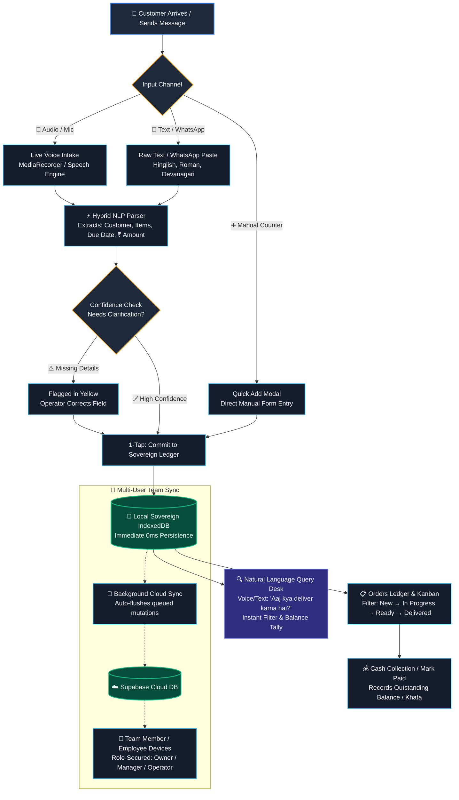
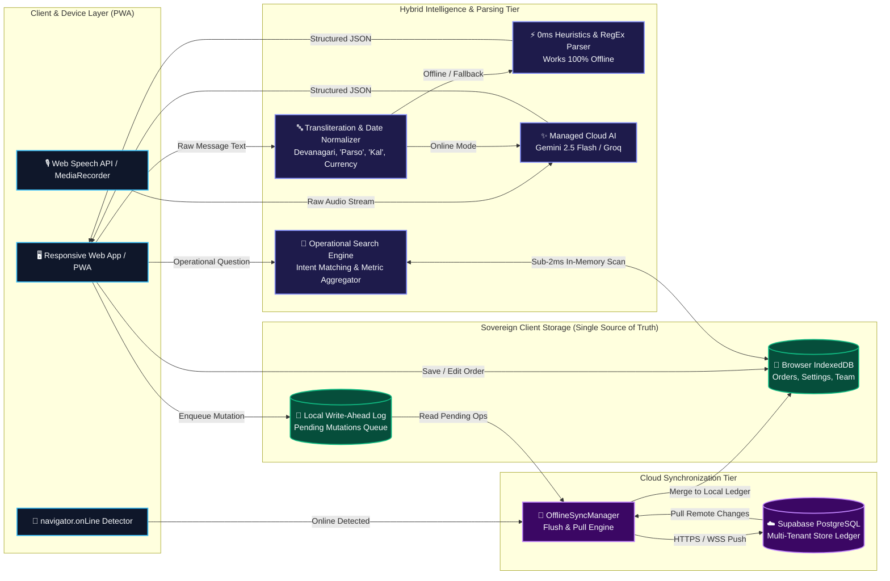

# 📊 Vendora — Presentation Flowcharts (User Flow & Data Flow)

> Designed for PPT slides, pitch decks, and technical evaluation.  
> You can paste the Mermaid diagrams below directly into [Mermaid Live Editor](https://mermaid.live) to export transparent high-res PNG/SVG images, or copy the PPT text blocks into your slides.

---

## 1. User Flow Diagram (Operational Lifecycle)



---

## 2. PPT Slide Ready: User Flow (Text & Block Format)

Copy-paste this directly into a 4-column PPT slide:

```
┌────────────────────────┐      ┌────────────────────────┐      ┌────────────────────────┐      ┌────────────────────────┐
│  1. INTAKE & PARSE     │  ──> │  2. 0ms LOCAL COMMIT   │  ──> │  3. FULFILLMENT        │  ──> │  4. QUERY & SYNC       │
├────────────────────────┤      ├────────────────────────┤      ├────────────────────────┤      ├────────────────────────┤
│ • Voice Mic / Audio    │      │ • Instant Structured   │      │ • Kanban Progression:  │      │ • Natural Voice Desk:  │
│ • WhatsApp / SMS Paste │      │   Review (Name, Date,  │      │   New → Progress →     │      │   "Aaj kya deliver     │
│ • Hinglish, Numerals & │      │   Items, ₹ Amount)     │      │   Ready → Delivered    │      │   karna hai?"          │
│   Devanagari Parsing   │      │ • 1-Tap Save to        │      │ • Payment Settle:      │      │ • Auto Cloud Backup    │
│ • Hybrid AI + Heuristic│      │   Sovereign IndexedDB  │      │   Advance / Balance    │      │   to Supabase when     │
│   (Zero lock-in)       │      │ • 100% Offline Capable │      │   Tracking (Khata)     │      │   Internet reconnects  │
└────────────────────────┘      └────────────────────────┘      └────────────────────────┘      └────────────────────────┘
```

---

## 3. Data Flow Diagram (Architectural Pipeline)



---

## 4. PPT Slide Ready: Data Flow (Text & Block Format)

Copy-paste this directly into an Architecture / Data Flow slide:

```
┌──────────────────────────────────────────────────────────────────────────────────────────────────┐
│                                 1. CLIENT INTAKE & SENSORY LAYER                                 │
│  • PWA Web UI (Mobile & Desktop)     • Audio MediaRecorder (Voice Mic)     • Network Listener    │
└──────────────────────────────────────────────────────────────────────────────────────────────────┘
                                                │
                                                ▼
┌──────────────────────────────────────────────────────────────────────────────────────────────────┐
│                                  2. DUAL-TIER HYBRID PARSER                                      │
│  • Fast Offline Engine: RegEx + Hinglish Date Resolver ('parso', 'agle hafte', Devanagari ₹)      │
│  • Online Cloud Engine: Managed Gemini 2.5 Flash for nuanced, ambiguous multi-item transcripts   │
└──────────────────────────────────────────────────────────────────────────────────────────────────┘
                                                │
                                                ▼
┌──────────────────────────────────────────────────────────────────────────────────────────────────┐
│                           3. SOVEREIGN CLIENT STORAGE (GROUND TRUTH)                             │
│  • IndexedDB (Orders, Settings, Capacity)   ──> Sub-2ms instant local read/writes                │
│  • Write-Ahead Mutation Log (WAL)           ──> Guarantees zero data loss in airplane mode        │
└──────────────────────────────────────────────────────────────────────────────────────────────────┘
                                                │
                                                ▼ (When Internet Available)
┌──────────────────────────────────────────────────────────────────────────────────────────────────┐
│                            4. BACKGROUND CLOUD RECONCILIATION                                    │
│  • OfflineSyncManager batches and pushes queued mutations via HTTPS to Supabase PostgreSQL       │
│  • Multi-device team synchronization across Store Owner, Managers, and Counter Operators         │
└──────────────────────────────────────────────────────────────────────────────────────────────────┘
```

---

## 5. Key Highlights to Speak to During PPT Presentation

1. **True Sovereign Offline-First**:
   - The device never waits for a cloud response to commit an order. Counter checkouts occur at **0ms latency** on local IndexedDB.
2. **Hybrid Intelligence**:
   - If there is internet, high-accuracy LLM intelligence parses complex multi-item conversations.
   - If power or cellular data cuts out in the bazaar, deterministic local heuristics take over without interruption.
3. **Frictionless Natural Language Desk**:
   - Shopkeepers do not write complex SQL or filter through spreadsheets. They speak or tap: *"Kiska paisa baki hai?"* and get immediate real-time metrics.
4. **Role-Based Store Security**:
   - Store owners invite employees with granular access; employees can fulfill orders and log counter transactions without risking business configuration or store sovereignty.
